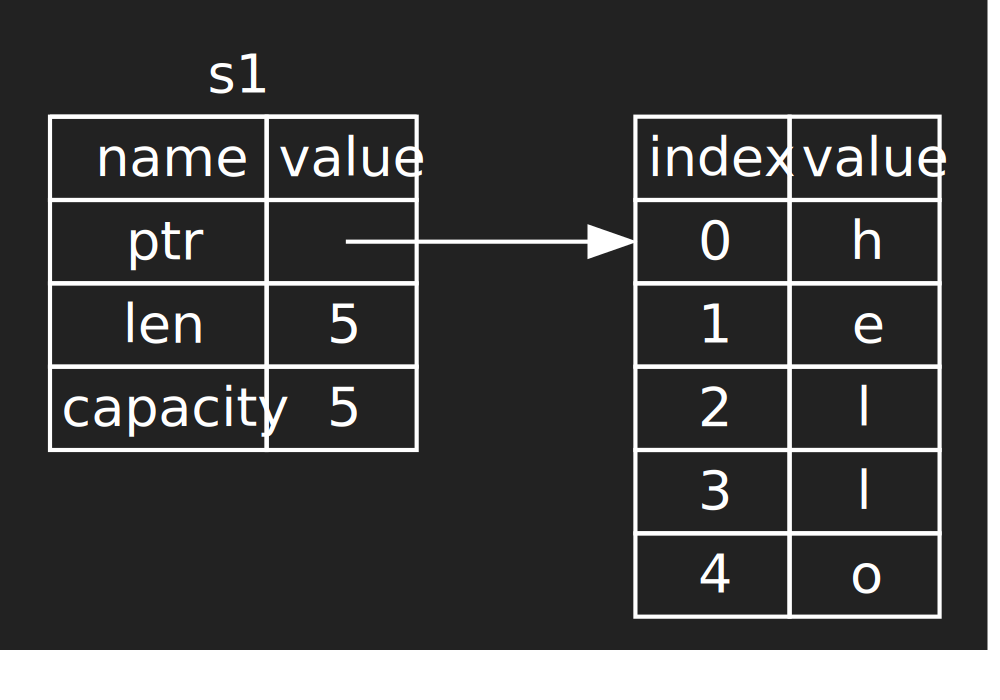
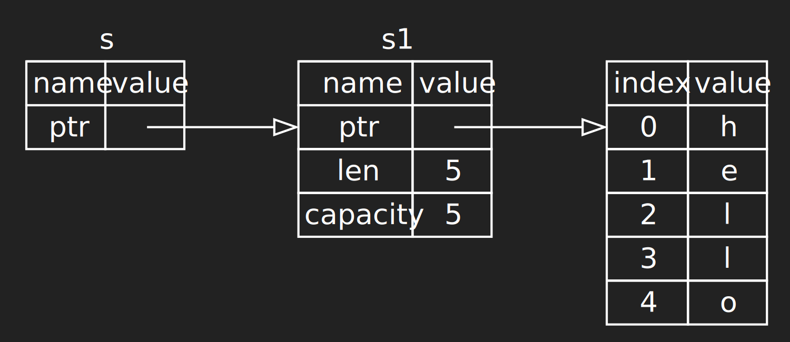
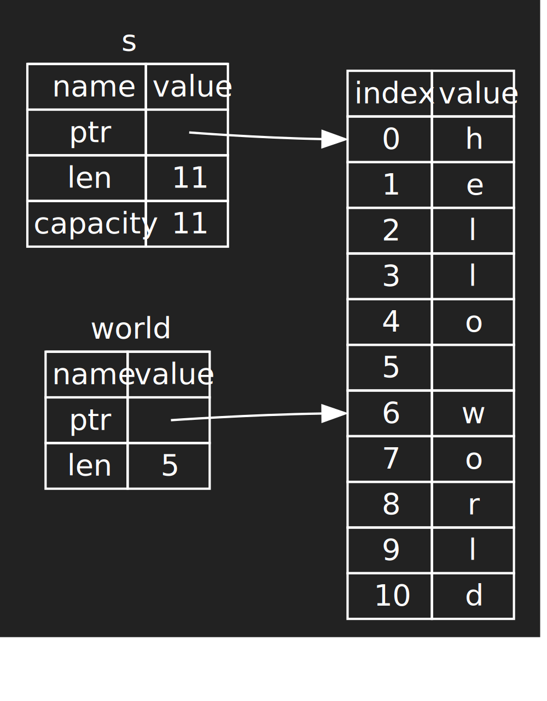
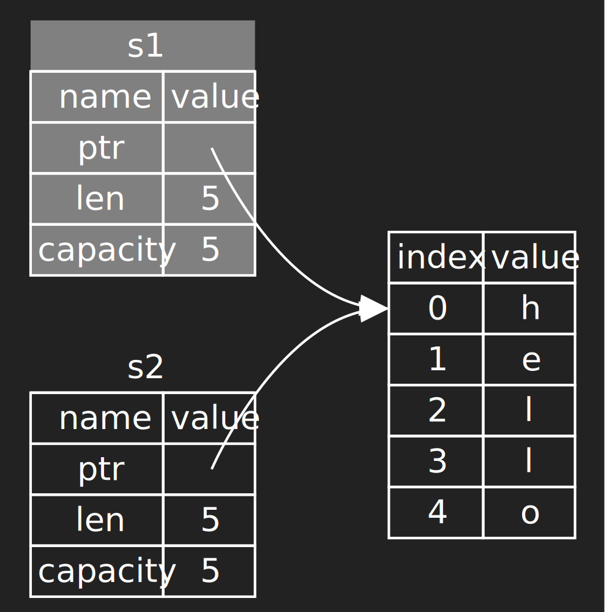

<!-- .slide: class="center" -->
# Ch3. Basic Types

---

# Primitives

- Signed and unsigned integers:

    `i8`, `i16`, `i32`, `i64`  
    `u8`, `u16`, `u32`, `u64`

- Floats: `f32`, `f64`

- Size of an address: `usize`, `isize`

- Unicode character: `char` (32 bits)

---

# As Operator

`as` casts primitives types, might truncate or wrap

```rust
-1_i8 as u8 == 255
true as i32 == 1
```

Safe? Fully defined behaviour but perhaps not what you want...

Indices have type `usize`

```rust
let index: i32 = -1
let element = vec[index as usize]
// unlikely to find anything at index 2^64 - 1
```

---

# Tuples

Fixed number of values, can be different types

```rust
let pair: (&str, i32) = ("Cat", 100)```

Handy for returning multiple values from a function

```rust
fn max_with_index<T>(v: Vec<T>) -> (usize, T)
```

Access by known position or pattern matching

```rust
let index = max_with_index(v).1
let (max, index) = max_with_index(v)
```

---

# Unit

Type with just one value, `()`

Equivalent to `void` in many languages

Actually a zero-tuple!

The default function return type if not specified
```rust
fn side_effects_only(i: i32) -> () {}
fn side_effects_only(i: i32) {}
```

---


# Flavours of pointer

- box, `Box<i32>`  
*owned by me*
- reference, `&i32`  
*owned by someone else*
- raw pointer, `*i32`  
*who knows -- unsafe code only!*

References (and pointers) can be mutable or immutable -- the default

---

# Arrays, vectors, slices

- `Vec<T>` is a growable sequence of `T`s on the heap.  
Equivalent to a Java ArrayList or a Python list.

- `[T; 20]` is an array of `T`s with a known size of 20 elements.

- `&[T]` is a *slice*, a reference to a series of elements in some array or vector

---

# Slices

Can be mutable or immutable

Many common functions like searching and sorting are actually defined on slices

Vectors and arrays can be passed to a function expecting a slice

Slices include not only a reference (pointer) but also a length, enabling bounds checking

---

# Examples

```rust
let arr: [i32; 4] = [1, 2, 4, 7];
// macro to make initialising vectors pleasant
let vec: Vec<i32> = vec![1, 2, 4, 7];
vec.push(10);
```
```rust
fn shuffle<T>(elements: &mut [T]) {}
// implicitly turned into a slice
shuffle(&arr)
shuffle(&vec)
// supports sub-sequences for free!
shuffle(&vec[2..4])
```

---

# Two types of string

- `String`: a resizable vector of characters.  
*Like a `Vec<u8>`*
- `&str`: a reference to a series of characters owned by someone else.  
*Like a `&[u8]` slice*

This is equivalent to the distinction between `std::string` and `const char*` in C++

Only 8 bits? In fact all strings are stored as UTF-8

---


# Which string type?

Generally `&str` is used for function arguments, because the caller can pass a `&str` value or take a reference to a `String`

But a `String` is needed to own the data e.g. in a struct or when returning a new string from a function

---

# Literals

String literals are actually of  type `&str`
```rust
let text: &str = "hello world"
```

Why? `text` is really a reference to some buffer in your `hello_world` binary

What if a `String` is needed? Too often you need to do
```rust
silly_function("hello_world".to_string())
```

---

# Mutability

`String` is mutable, `&str` is not.

What about a `&mut str`? It exists but it's not useful, because modifying characters in a UTF-8 string can change its length

---

<!-- .slide: class="center" -->
# Slicing examples

---

```rust
let s1: String = "hello".to_string()
```



---


```rust
let s1: String = "hello".to_string()
let s: &String = &s1
```



---


```rust
let s: String = "hello world".to_string()
let world: &str = &s[6..11];
```
 <!-- .element: height="600px" -->

---

<!-- .slide: class="center" -->
# Ch4. Ownership

---

# What is ownership?

- The owner of a value detemines when to drop it (free up memory or resources it uses)
- In Rust, every value has one owner
- When an owner is dropped all data it owns is also dropped.

Rust has no garbage collection. The ownership rules aim to ensure that allocated memory is freed when it's no longer needed.

Rust also ensures that you are not allowed to access a value that has been dropped.

---

# Scoping

Values are freed when they go out of scope

```rust
fn foo() {
    // allocate string on heap
    let s = "hello".to_string(); 
    // new string allocated
    let g = format!("{} world", &s); 
} // s and g are dropped here

```

---

# Box

`Box<T>` is a simple owned pointer to the heap

```rust
fn foo() {
    // allocate tuple on heap
    let p = Box::new((1, 3));
    // new string allocated
    let g = format!("point at {:?}", p); 
} // p and g are dropped here
```

Dropping is recursive, so if you had a `Box<Vec<_>>`, when the box went out of scope, it would drop the vector, which would in turn drop its elements

---

# Moving ownership

Operations like **assignment**, passing arguments or returning values _move_ the ownership of the value

```rust
let s1 = "hello".to_string();
let s2 = s1;
```
```rust
println!("{} world", s1)
// error: s1 has been moved
// we can't use it any more
```

Values that have been moved to another owner can be thought of as uninitialised data

---

 <!-- .element: height="650px" -->


---


# Moving ownership

Operations like assignment, **passing arguments** or returning values _move_ the ownership of the value

```rust
fn eat(s: String) {}
```
```rust
let s = "hello".to_string()
eat(s)
```
```rust
print!(s)
// error: s has been moved
// we can't use it any more
```

---

# Moving ownership

Operations like assignment, passing arguments or **returning values**  _move_ the ownership of the value

```rust
fn greet(name: String) -> String {
    format!("hello {}", name)
}
let m = greet("world".to_string());
```

Did we forget to clean anything up? Who owns what?
- `greet` owns `name` so our "world" string is dropped at the end of the function
- the returned string is moved to the caller as `m`

---

# Is moving expensive?

Data is not actually moved around most of the time

- When we are moving a `String`, we just move its actual value (ptr, length, capacity), not the buffer of characters on the heap that it points to
- The compiler tries to elide moves and put the data directly where it is needed on initialisation

---

# Copy types

Values such as primitives are small and own no heap data or other resources, so they are cheap to clone.

They are `Copy` types, which means that they are always copied instead of moved.

```rust
let n1 = 42
let n2 = n1;
```
```rust
println!("{} is the answer", n1)
// no error: integers are Copy types
// n2 is a copy of n1 and we still own n1
```

---

# Copy types

A `Copy` type is one where a full clone of the value merely requires a bit-by-bit copy of its data.

This is evidently not true for a `String` because the heap buffer it points to must also be cloned. This careful handling is why Rust mandates moving by default.

---

# The ownership model

Rust's strict ownership is a trade-off.

It provides very strong guarantees
- freeing of memory and resouces is deterministic
- use-after-free bugs cannot occur in safe code

There is no manual memory management by the programmer and yet no garbage collection overhead

However, it is often hard to structure code such that values have a single unique owner

---

# Reference counting

Rust provides reference counted pointers `Rc<T>` as a fallback when single ownership is too complicated

```rust
let s: Rc<String> = Rc::new("s".to_string());
let s2: Rc<String> = s.clone();
let s3: Rc<String> = s.clone();
```

`.clone()` on an `Rc` creates a new reference and increments the reference count

The value is dropped when the last reference to it goes out of scope

---

